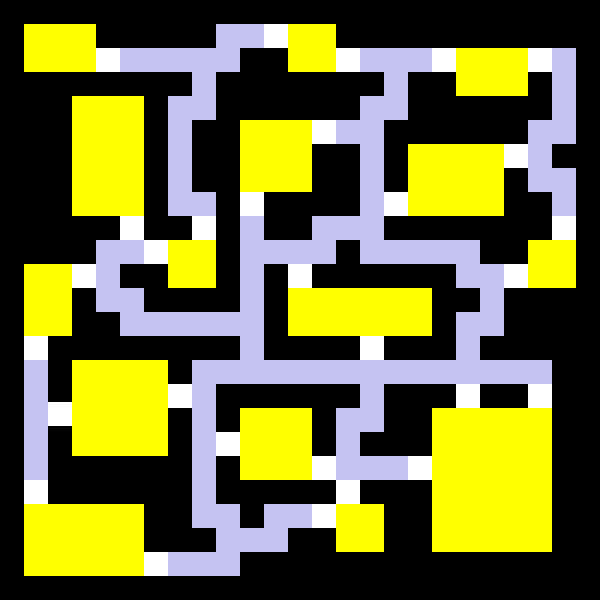
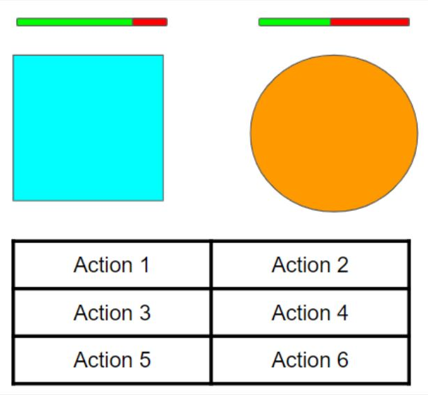

# Team IDK
 
## Canonical game repo URL:
 
https://github.com/Yanding-Liu/Team-IDK-game-project.git
 
## Team Members
* Advanced Topic Subteam 1: Procedural Generation
 
    * Yanding Liu
        * Pitt Username: yal136
        * Github Username: Yanding-Liu
 
    * Brian Lucas
        * Pitt Username: btl26
        * Github Username: BrianLucas26
 
    * Mike Schafer
        * Pitt Username: mws69
        * Github Username: mws69
 
* Advanced Topic Subteam 2: AI
 
    * Yuanheng Qu
        * Pitt Username: yuq15
        * Github Username: YUQXVI
 
    * John Stroud
        * Pitt Username: jos247
        * Github Username: Mekarth
 
    * Mark Marquez
        * Pitt Username: mjm388
        * Github Username: mjm388
 
    * Qirui Liu
        * Pitt Username: qil73
        * Github Username: Zezumo
 
## Game Description
A rogue-like exploring turn-based game. The player would be generated in a floor containing multiple rooms that were procedural generated. The main goal is to find a “key” randomly put in one room and use it to escape from a randomly located exit. During the exploration, the player will randomly encounter enemies which will instantly start a battle. The battle is turn-based, and the enemies will be coded with advanced AI algorithms that allow them to react to the player’s tactics.
 
 
 
## Advanced Topic Description
 
### ADVTOPIC1 - Procedural Generation
 
The entirety of our map generation consists of 4 main sections:
- Randomly generating rooms
- Randomly placing rooms
- Generating paths between rooms
- Generating game elements
 
Randomly generating rooms:
  Each room type will have different attributes that influence how it is generated. Some rooms will have different wall partitions, a varying amount of objects/assets, and will be different sizes. These attributes will be influenced by a random number. For instance, if a room has a high size attribute and a low asset attribute, the room will be larger and there will be less assets placed around the room (such as furniture, creepy statues, etc).
 
Placement of rooms:
  Our large-scale map will be an x by y grid layout, with each room a subset of this x y grid. Once we’ve generated our room, we will randomly choose a location on our grid for the room to be placed (x1 - x2, y1 - y2). Before placing this room in this location, we will have to check if there already exists a room in that location or directly next to it. We can store this grid as a 2-D array containing a value that shows if it is taken. We will generate and place a certain number of rooms.
	After placing all of our rooms on the map, we will then create a Delaunay triangulation graph from each of the rooms using the Bowyer-Watson algorithm. This will create connections between the rooms while keeping those connections relatively short. 
 
Generating paths between rooms:
  Once we’ve created the Delaunay triangulation graph, we will calculate the minimum spanning tree using Prim’s algorithm or Dijkstra’s algorithm to find the main routing path between the rooms. We will then randomly select a few other edges from the triangulation graph to create a few loops in the map layout. 
  Using the A* search algorithm, we will create the exact layout and path of the hallways between our selected edges from the previous step. 
 
Generating game elements:
  To generate our game elements (Starting position/ Key/ Locked door) we will simply randomly select a starting room. To generate the room for the key and locked door, we will perform a DFS traversal starting from the starting room, placing the key and locked door once we’ve reached the furthest away from the root node, while also making sure they are in different rooms. 
 
   
### ADVTOPIC2 - AI
 
Our combat system would be a turn-based card game that takes place between the player and one enemy AI at a time. The main goal for the player is to reduce the enemy HP to 0 to win the battle, and vice versa. For the enemy AI, we decided to use reinforcement learning to train them through Q-learning. We think that for a turn-based game, Q-learning can suit the scenario well. It will update the state-action table through training. We will assign two terminal states to it, one is defeating the player, which will be rewarded greatly, and the other is being defeated, which is what we would like it to avoid. We would be assigning states based on the combination of actions made by the player and the current state of both sides. The algorithm will be based on the Bellman Equation for the value iteration update. The rewards that we assign will be based on damage dealt towards the player and damage taken by the AI. We might be training different sets of AIs by modifying the discount factor.

## Concept Arts

## Midterm Goals
 
* Have a working map/room
* Player movement and collision 
* Implement combat moveset/system
* Transition from exploration to combat
* Have working UI
 
 
## Final Goals
 
* Functional turn-based combat (20%)
  * Player can choose moves (10%)
  * Transition between exploration screen and combat screen (5%)
  * Display UI (5%)
* Implement moveset for AI (30%)
  * Implement Q-Learning Algorithm (10%)
  * Have AI work with basic moveset (10%)
  * Have AI work with larger advanced moveset (10%)
* Working procedural generated maps/rooms (30%)
  * Randomly generated room (10%)
  * Randomly generated map made of rooms (10%)
  * Character can interact with map/room (10%)
 
 
## Stretch Goals
 
* Fog of War System (5%)
* Final Boss (5%)
